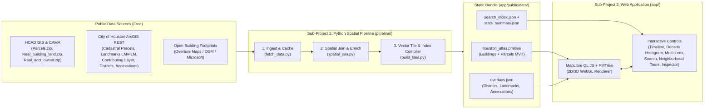

# The Houston Building Atlas v2 — System Design Specification

**Date:** 2026-10-05  
**Organization:** Preservation Houston  
**Author:** Dave Morris (with Superpowers Architectural Design)  
**Repository:** `/usr/local/google/home/davemorris/houston-building-atlas`

---

## 1. Purpose & Goals

The Houston Building Atlas v2 replaces the legacy Google Earth Engine implementation (`projects/ph-ee-sandbox/assets/*`) with a zero-hosting-cost, open-source, GPU-accelerated web mapping application and reproducible geospatial data pipeline.

### Key Objectives
1. **Building Footprint Polygons First:** Display actual building outlines (footprints) color-coded by structure completion year (`year_built`), with an optional toggle to display tax parcel boundaries (`parcels`).
2. **60 FPS Real-Time Filtering & Time-Lapse:** Filter and re-color buildings across 1836–2026 in `<16ms` on the client GPU using MapLibre GL JS vector layers—enabling smooth dual-slider scrubbing, decade selection, and animated time-lapse playback.
3. **Zero Recurring Hosting Cost ($0/month):** Compile spatial layers into static PMTiles (`.pmtiles`) and GeoJSON/JSON indices that can be hosted on any static CDN or object storage bucket supporting HTTP Range Requests (e.g., Cloudflare Pages + R2 free tier, GitHub Pages, or GCS) without a database server or paid ArcGIS/Google Maps credits.
4. **Rich Preservation Context:** Integrate City of Houston Historic Landmarks (`LM`), Protected Landmarks (`PLM`), Authoritative Historic District Contributing/Non-Contributing parcel classifications, City Historic Districts, Heritage Districts, National Register Districts, Texas Historical Commission (THC) Markers, and Houston Annexation History (1836–2020).
5. **Reproducible Data Pipeline:** Provide an automated Python (`uv`) ETL pipeline supporting both a fast **Historic Houston Core** slice (`--mode core`, ~1–2 minutes) and a **Full Harris County** (~2 million parcels/buildings, `--mode full`) batch build.

---

## 2. System Architecture

---

## 3. Data Sources & Schema Specification

### 3.1 Authoritative Upstream Endpoints

| Dataset | Source | URL / Endpoint | Key Fields |
| :--- | :--- | :--- | :--- |
| **HCAD Tax Parcels (Bulk)** | HCAD GIS | `https://download.hcad.org/data/GIS/Parcels.zip` | `HCAD_NUM`, polygon geometry |
| **HCAD Building Records (Bulk)** | HCAD CAMA | `https://download.hcad.org/data/CAMA/2025/Real_building_land.zip` | `acct`, `date_erect`, `yr_remodel`, `im_sq_ft`, `style_desc`, `stories` |
| **HCAD Account & Owner (Bulk)** | HCAD CAMA | `https://download.hcad.org/data/CAMA/2025/Real_acct_owner.zip` | `acct`, `site_addr_1`, `mailto`, `acreage`, `state_class`, `lgl_1` |
| **COH Pre-Joined Cadastral Parcels** | City of Houston GIS | `https://mycity2.houstontx.gov/gisweb01/rest/services/HoustonMap/Cadastral/MapServer/0` | `TAX_ID`, `YR_IMPR`, `SITE_ADDR_1`, `OWNER_MAILTO`, `TOTAL_BUILDING_AREA`, `LANDUSE_DSCR`, `ECON_BLD_CLASS`, `LEGAL_DSCR_1`, `PDLandMark` |
| **COH Authoritative Historic Parcels** | COH Historic Preservation | `https://services.arcgis.com/NummVBqZSIJKUeVR/arcgis/rest/services/Authoritative_Historic_Layer_and_Updated_Landmarks/FeatureServer/2` | `HCAD_NUM`, `Yr_Impr`, `Site_addr_1`, `Building_Classification` (`Contributing` / `NonContributing`), `Historic_District_Name`, `Landmark_Designation` |
| **COH Historic Landmarks (`LM`/`PLM`)** | COH Historic Preservation | `https://services.arcgis.com/NummVBqZSIJKUeVR/arcgis/rest/services/Authoritative_Historic_Layer_and_Updated_Landmarks/FeatureServer/0` | `USER_SITE_NAME`, `USER_SITE_ADDRESS`, `LandmarkDesignation`, `USER_YR_BUILT`, `USER_ARCHITECT___BUILDER`, `USER_STYLE`, `USER_HCAD_NUM`, `USER_HISTORIC_DISTRICT` |
| **COH Historic Districts** | City of Houston GIS | `https://mycity2.houstontx.gov/gisweb01/rest/services/HoustonMap/Planning_and_Development/MapServer/8` | `NAME`, `DIST`, polygon geometry |
| **COH Heritage Districts** | City of Houston GIS | `https://mycity2.houstontx.gov/gisweb01/rest/services/HoustonMap/Planning_and_Development/MapServer/41` | `NAME`, `DATE_EST`, `DESIGN_GUIDELINES`, polygon geometry |
| **National Register Districts** | City of Houston GIS | `https://mycity2.houstontx.gov/gisweb02/rest/services/HoustonMap/Planning_and_Development/MapServer/9` | `NAME`, `DIST`, polygon geometry |
| **COH Annexation History (1836–2020)** | City of Houston GIS | `https://mycity2.houstontx.gov/gisweb01/rest/services/PDD/Annexation_History/MapServer/{0..14}` | Decade layer name (`1836`..`2020`), polygon geometry |
| **THC Historical Markers** | Texas Historical Commission | `https://services7.arcgis.com/2hv9bZMrcgZpr7i9/arcgis/rest/services/historical_marker/FeatureServer/0` | `MarkerNum`, `NAME`, `AtlasNum`, point geometry |
| **Building Footprints** | OpenStreetMap / Overture Maps | Overpass API (core slice) / Overture Maps GeoParquet (full county) | Building footprint polygon geometry, `building` tag, `building:levels`, `height` |

### 3.2 Unified Building & Parcel Feature Schema

Every feature in the `buildings` and `parcels` vector layers conforms to the following normalized property schema:

| Property | Type | Description |
| :--- | :--- | :--- |
| `id` | `string` | Unique feature ID (`bld_<index>` or `pcl_<hcad_num>`) |
| `hcad_num` | `string` | 13-digit HCAD Account Number (e.g., `"0010010000001"`) |
| `address` | `string` | Primary street address (e.g., `"1506 HEIGHTS BLVD"`) |
| `year_built` | `number` | Earliest known construction year (`1836`–`2026`, or `0` if unknown/vacant) |
| `decade` | `number` | Construction decade (`Math.floor(year_built / 10) * 10`, or `0` if unknown) |
| `remodel_year` | `number` | Year remodeled if available (`0` if none) |
| `owner` | `string` | Current owner name from HCAD/COH |
| `bld_area` | `number` | Total building area in square feet (`0` if unknown) |
| `land_area` | `number` | Parcel land area in square feet |
| `stories` | `number` | Estimated number of stories (default `1`–`2` residential, derived from levels/area) |
| `height_m` | `number` | Extrusion height in meters (`stories * 3.5` or OSM/LiDAR height) |
| `use_category` | `string` | Normalized category: `"Residential"`, `"Multi-Family"`, `"Commercial"`, `"Civic / Institutional"`, `"Industrial"`, `"Vacant / Exempt"` |
| `landuse_desc` | `string` | Detailed HCAD/COH land use description |
| `bld_style` | `string` | Architectural style or HCAD building class description |
| `subdivision` | `string` | Legal subdivision / block / lot description |
| `historic_district` | `string` | Name of City of Houston Historic District (`""` if outside) |
| `contributing` | `string` | `"Contributing"`, `"Non-Contributing"`, or `"Outside Historic District"` |
| `landmark_name` | `string` | Historic Landmark site name if designated (`""` otherwise) |
| `landmark_type` | `string` | `"Protected Landmark"`, `"Landmark"`, or `""` |
| `architect` | `string` | Architect / builder name from COH Landmark record (`""` if unknown) |

### 3.3 Spatial Join Algorithm (`pipeline/spatial_join.py`)
1. **Normalize Parcels:** Combine COH Authoritative Historic Parcels (`FeatureServer/2`) and HCAD/COH Cadastral Parcels, deduplicating by `hcad_num` and prioritizing historic preservation metadata (`Building_Classification`, `Historic_District_Name`, `Landmark_Designation`) and Landmark point/HCAD joins (`FeatureServer/0`).
2. **Match Footprints to Parcels:**
   * Compute the representative point (`representative_point()`) of each building footprint polygon.
   * Perform an R-tree spatial index lookup (`shapely.STRtree`) against parcel polygons.
   * Stamp the matched parcel's attributes onto the building footprint polygon.
   * For parcels that have a valid building (`year_built > 0` or `bld_area > 0`) where no external OSM/Overture footprint polygon is present yet, derive an inset architectural building footprint polygon inside the parcel boundary (scaled proportionally to `bld_area / land_area` and oriented along the parcel's minimum rotated rectangle) so 100% of built properties render cleanly in Building Outline mode while maintaining a `footprint_source: "observed" | "derived_parcel"` flag.

---

## 4. Frontend Application Design (`app/`)

### 4.1 Aesthetic Direction & Color System
* **Theme:** Archival Cartographic Editorial—warm parchment map canvas (`#F6F3EC`) in Light Mode and deep charcoal-navy (`#0F141C`) in Dark Mode, paired with a high-contrast sidebar and floating glassmorphic map controls.
* **Typography:**
  * Headings / Landmark Titles: `'Fraunces'` or `'Newsreader'` (serif editorial authority)
  * UI Controls & Labels: `'Plus Jakarta Sans'` (clean geometric legibility)
  * Years, Coordinates, HCAD Numbers & Metrics: `'JetBrains Mono'` (`font-variant-numeric: tabular-nums`)
* **Color-By Lenses:**
  1. **Year Built (Default — 9-Step Historical Spectrum + Grey Unknown):**
     * `1836–1899` (19th Century Pioneer & Victorian): `#5C1A1B` (Deep Oxblood)
     * `1900–1909` (Turn of the Century): `#8C2D19` (Crimson Brick)
     * `1910–1919` (Streetcar Suburb Era): `#B8421B` (Burnt Sienna)
     * `1920–1929` (Roaring Twenties Boom): `#D96B27` (Terracotta Orange)
     * `1930–1939` (Depression & Art Deco): `#E8993A` (Warm Amber)
     * `1940–1949` (WWII & Post-War Cottage): `#E2C25A` (Ochre Gold)
     * `1950–1959` (Mid-Century Ranch Boom): `#7FB285` (Mid-Century Sage)
     * `1960–1979` (Space Age & Astrodome Era): `#3D8B8E` (Teal Slate)
     * `1980–2026` (Contemporary Houston): `#2B5B84` (Modern Steel Blue)
     * `0 / Unknown / Vacant`: `#CFCBC2` (Muted Stone)
     * *(Users can also switch the Year Built palette to the classic Earth Engine `YlOrRd` ramp with 1 click.)*
  2. **Historic Preservation Status Lens:**
     * `Protected Landmark (PLM)`: `#0EA5E9` (Brilliant Cyan-Blue)
     * `Historic Landmark (LM)`: `#6366F1` (Indigo)
     * `Contributing Structure`: `#16A34A` (Preservation Emerald)
     * `Non-Contributing Structure`: `#EA580C` (Amber-Orange)
     * `Outside Historic District`: `#94A3B8` (Muted Slate)
  3. **Property / Land Use Lens:**
     * `Residential`: `#D97706`
     * `Multi-Family`: `#9333EA`
     * `Commercial`: `#E11D48`
     * `Civic / Institutional`: `#0284C7`
     * `Industrial`: `#475569`
     * `Vacant / Exempt`: `#CBD5E1`

### 4.2 Interactive Modules (`app/src/`)

| Module | File | Responsibility |
| :--- | :--- | :--- |
| **Domain Types & Palettes** | `src/types/atlas.ts`, `src/config/palettes.ts` | Strongly typed filter state, lens definitions, color stops, MapLibre style expressions, and neighborhood presets. |
| **Filter & Timeline Engine** | `src/state/filterStore.ts` | Reactive state store managing `minYear`, `maxYear`, `selectedDecade`, `colorLens`, `paletteId`, `is3D`, `activeLayers`, `annexationDecade`, `selectedFeature`, and URL query-string synchronization. |
| **Map Controller** | `src/map/MapController.ts` | Initializes MapLibre GL JS + PMTiles protocol, loads basemap (Light Archival / Dark / Satellite), registers `buildings` (2D & 3D extrusion), `parcels`, `historic-districts`, `heritage-districts`, `nrhp-districts`, `annexation-history`, `landmarks`, and `thc-markers` layers, and applies `<16ms` GPU filter/paint updates. |
| **Header & Search Bar** | `src/components/HeaderBar.ts` | Preservation Houston brand header, instant fuzzy search across addresses/landmarks/districts/HCAD IDs, curated Neighborhood Tour buttons, 2D/3D toggle, Basemap toggle, and Share Link button. |
| **Lens & Layer Sidebar** | `src/components/LayerPanel.ts` | Collapsible left panel with Color-By Lens selector, interactive color legend, palette switcher (`Archival Spectrum` vs `Classic YlOrRd`), and layer visibility checkboxes with feature counts. |
| **Timeline & Histogram Dock** | `src/components/TimelineDock.ts` | Bottom dock with dual-handle Year Built range slider (1836–2026), Decade dropdown, Play/Pause time-lapse engine ($1\times, 2\times, 5\times$ speed + "Sync Annexation Boundary" toggle), and live viewport **Buildings by Decade** interactive bar chart. |
| **Property & Landmark Inspector** | `src/components/InspectorDrawer.ts` | Right slide-over drawer displaying full property & historic metadata, Contributing/Landmark badges, architect & style notes, direct link to HCAD official record, and deep-link sharing. |

---

## 5. Error Handling & Resilience
1. **Graceful Data Fallback:** The web app supports loading vector tiles from `houston_atlas.pmtiles` AND seamlessly falls back to/combines GeoJSON sources (`buildings.geojson`, `parcels.geojson`, `overlays.json`) so local development and testing work with zero external network dependencies.
2. **Upstream GIS API Resilience:** `pipeline/fetch_data.py` retries transient HTTP errors with exponential backoff, caches raw responses in `pipeline/cache/`, and validates geometry integrity (`shapely.make_valid`) before spatial joins.
3. **Missing / Imprecise HCAD Dates:** Properties with `year_built == 0` or `null` are explicitly categorized as `"Unknown / Unrecorded"` with a dedicated toggle ("Show properties with unrecorded build year") so users can either include or hide gray unrecorded parcels when scrubbing through time.

---

## 6. Verification & Testing Strategy
1. **Pipeline Unit & Integration Tests (`pytest`):**
   * Verify HCAD/COH attribute normalization, year-built parsing, decade bucketing, and land-use classification.
   * Verify spatial join accuracy (`sjoin_buildings_to_parcels`) including observed footprints, derived footprints, and multi-feature attributes.
   * Verify PMTiles / GeoJSON output generation and search index completeness.
2. **Frontend Unit Tests (`vitest`):**
   * Verify `filterStore` state transitions, decade selection, URL query parameter serialization/deserialization, and MapLibre filter expression generation.
   * Verify palette expression builders for all three lenses (`year_built`, `contributing`, `use_category`).
3. **End-to-End Browser Verification:**
   * Launch Vite dev server and inspect in headless Chrome via DevTools MCP (`take_screenshot`, `list_console_messages`, DOM interaction checks).
